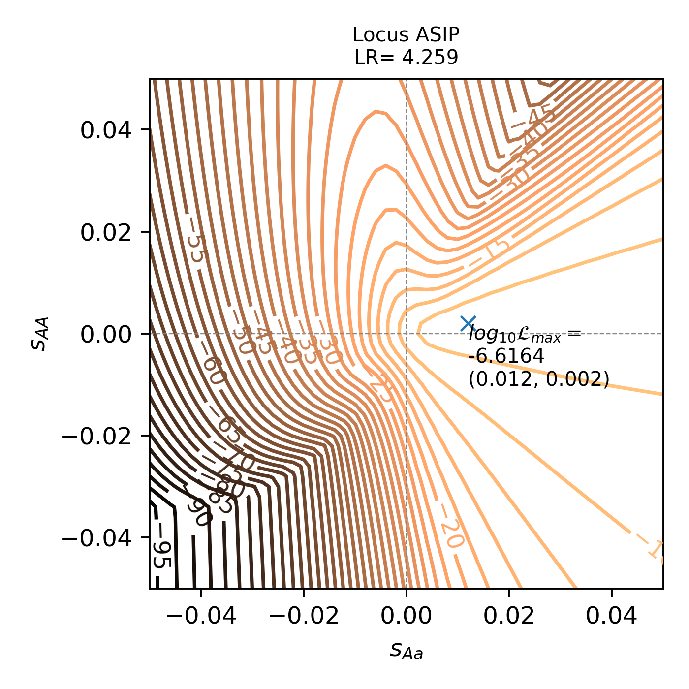
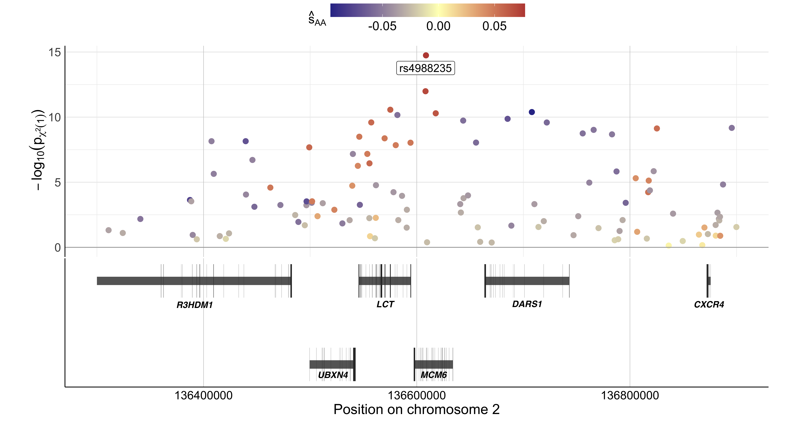
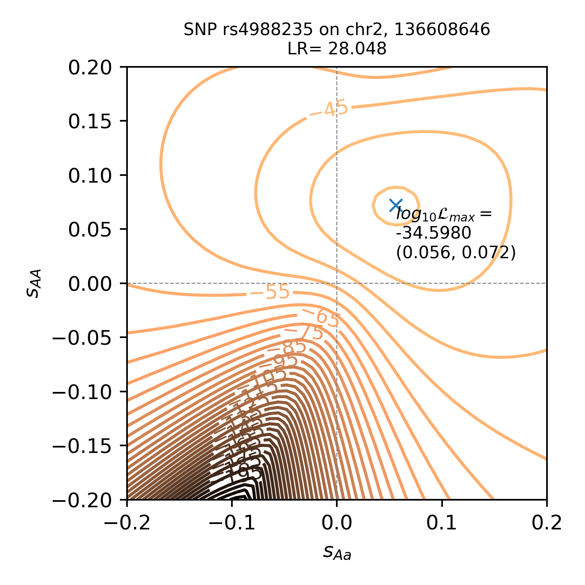
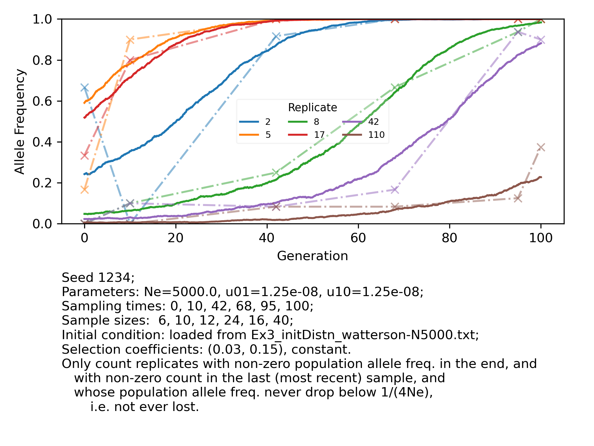
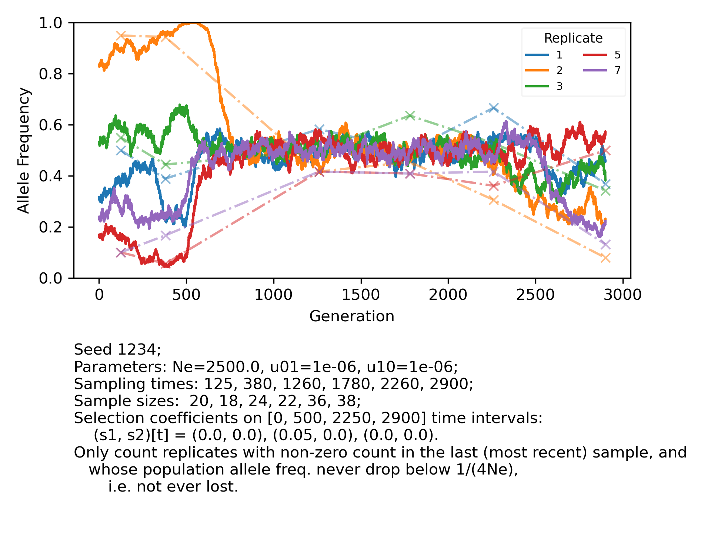

# `DiploLocus` Tutorial
## Set Up

To download input files to be used in this tutorial, first make sure `diplo-locus` package is installed in your local environment. Then, in the desired working directory, do

```shell
# only clone the `examples/` folder in the repo
## this command only create the repo directory & will not download any file yet
$ git clone -n --depth=1 --filter=tree:0 https://github.com/steinrue/diplo_locus
## move to the repo
$ cd diplo_locus/
## choose to only clone the `examples` folder:
$ git sparse-checkout set --no-cone examples
## check things out
$ git checkout

# move there
$ cd examples/
```

From here, all example cases in this tutorial will assume `example/` be the working directory.

Note: If you are using macOS, you might experience an error when calling `git`. A possible solution is to install the [XCode Command Line Tool Package](https://developer.apple.com/library/archive/technotes/tn2339/_index.html) by executing `xcode-select --install` in the terminal.

## Table of Contents
  * [Ex1: Computing likelihoods from allele count input](#ex1)
  * [Ex2: Computing likelihoods from VCF input](#ex2)
  * [Ex3: Simulate time-series data and plot trajectories](#ex3)

----------------
<a id="ex1"></a>
### Example 1: Log-likelihood surfaces for ancient horse MC1R and ASIP loci

Data for Example 1 initially came from [Ludwig _et al._ (2009)](https://www.science.org/doi/10.1126/science.1172750) and were used in [Steinruecken & Song (2014)](https://projecteuclid.org/journals/annals-of-applied-statistics/volume-8/issue-4/A-novel-spectral-method-for-inferring-general-diploid-selection-from/10.1214/14-AOAS764.full)

```shell
head Ex1_HorseLoci_count.txt
##Parameters used in Steinruecken & Song (2012):
### generation time 5 years,
### u01 = u10 = 1e-6,
### Ne = 2500, t0_asip = 7000/5 = 1400, t0_mc1r = 17000/5 = 3400
##SampTimes.year.ago: 20000, 13100, 3700, 2800, 1100, 500 (BCE)
##SampTimes.gen.ago: 4000, 2620, 740, 560, 220, 100
#locus   x1      n1      x2      n2      x3      n3      x4      n4      x5      n5      x6      n6
#ASIP    0       10      1       22      15      20      12      20      15      36      18      38
#MC1R    0       10      0       22      1       20      6       20      13      36      24      38
```

To compute log-likelihoods for either locus on a grid of selection coefficient values, one can use the following command line to run `DiploLocus`:

```shell
# Use initial condition of ASIP
DiploLocus likelihood --u01 1e-6 --Ne 2500 --gen_time 5 \ 
                -i Ex1_HorseLoci_count.txt \
                --sample_times_ago 20000,13100,3700,2800,1100,500 \
                --init initFreq --initFreq 2e-4 --t0 17000 --force_t0 \ 
                --linear_s1_range="-0.05,0.05,50" \
                --linear_s2_range="-0.05,0.05,50" \
                -o Ex1_ASIP-init_50x50linGrid5e-2 
```
The output will be written to `Ex1_ASIP-init_50x50linGrid5e-2_LLmatrices.table`. The user can find an example copy of this file in `example/example_output/`.

For reference, the command above took around 56 minutes to run on a 4.2 GHz Quad-Core Intel Core i7 with 32GB RAM. The argument `-v` (or `--verbose`) allows the program to report progress for every 5 sets of parameters computed.

As Steinruecken & Song (2014) examined different initial conditions for _MC1R_ and _ASIP_, to obtain log-likelihoods under another initial condition, one needs to run the program again. The command below is one option:

```shell
# Use initial condition of MC1R this time
DiploLocus likelihood --u01 1e-6 --Ne 2500 --gen_time 5 \ 
                -i Ex1_HorseLoci_count.txt \
                --sample_times_ago 20000,13100,3700,2800,1100,500 \
                --init initFreq --initFreq 2e-4 --t0 7000 --force_t0 \ 
                --linear_s1_range="-0.1,0.1,20" \
                --linear_s2_range="-0.1,0.1,20" \
                -o Ex1_MC1R-init_20x20linGrid1e-1 \
                --get_MLR --get_on_grid_max
```
This command finished within 7 min on the same machine and will generate plain text files `Ex1_MC1R-init_20x20Grid_LLsurfaces.table` and `Ex1_MC1R-init_20x20Grid1e-1_off-grid_maxLLs.txt`. These files are included for reference in `examples/example_output` folder.

In cases when the user did not include `--get_MLR` or `--get_on_grid_max` argument, it is possible to reuse the likelihood surfaces generated in the previous step to generate maximized likelihoods and matching parameters, for example:

```shell
DiploLocus likelihood --get_MLR --get_on_grid_max \
            --read_LL_from Ex1_ASIP-init_50x50linGrid5e-2_LLmatrices.table \
            -o Ex1_ASIP-init_50x50linGrid5e-2
```
This step will generate output file `Ex1_ASIP-init_50x50Grid5e-2_off-grid_maxLLs.txt`. Again, an example files is included in the folder `examples/example_output`.

Note that because the algorithm for interpolating 2D likelihood surfaces is not always stable, we disabled `--get_off_grid_max` for all cases where more than one selection parameter can take multiple values in their parameter spaces (that is, all cases where the parameter space is not one-dimensional).

With the computed log-likelihoods, the user can further visualize their trends in the predefined parameter space. As an example, the `plot_contours.py` script included in the `examples/` directory is a simplified case of plotting contours of log-likelihoods for each locus across the two-dimensional parameter space defined previously:
```shell
# script usage: %prog <input_name> <output_prefix>
python plot_contours.py Ex1_ASIP-init_50x50linGrid5e-2_LLmatrices.table Ex1_ASIP-init_50x50linGrid5e-2
```
This step will generate png plots named `<output_prefix>_<locusName>_contour.png`. Below is the plot for _ASIP_ (included in folder `examples/example_output`):

[](example_output/Ex1_ASIP-init_50x50linGrid5e-2_ASIP_contour.png)

----
<a id="ex2"></a>
### Example 2: Selection on SNPs in _LCT_/_MCM6_ locus within UK population in Allen Acient DNA Resources databse

Data for this example is extracted from [Allen Acient DNA Resources databse v54.1](https://reich.hms.harvard.edu/allen-ancient-dna-resource-aadr-downloadable-genotypes-present-day-and-ancient-dna-data). Details on how to download and parse the data can be found [here](https://github.com/steinrue/diplo_locus_manuscript_figs/blob/main/README.md#LCT). In brief, we identified non-related ancient genomes sampled in UK since 4500 years before present (1950 AC) and genotyped using 1240K enrichment capture. We compiled their SNPs and extracted site within the 2 Mbp genomic region centering on the _MCM6_/_LCT_ locus. Only SNPs with >0.05 pooled minor allele frequency are considered as informative. The resulting VCF file `Ex2_UK_v54.1_all_chr2_135e6-137e6.vcf` contains the genotypes of the individuals encoded as pseudo-haploids. The file `Ex2_v54_UK_1240K_noFam_strictPASS_from4500.info` contains the information on time of sampling of the individuals.

For general population parameters,we assume a per-generation mutation rate of 1.25e-8 per site, and take 5000 as the effective population size. We use a generation time of 28.1 years (Moorjani _et al._ 2016), and choose the uniform distribution as the initial condition. 


#### Assess evidence for selection on an extended genomic region

To compute log-likelihood ratios for all informative SNPs across this region, we only vary selection parameters in one dimension. Here, we assumed semi-dominance, _i.e._ the fitness effects are additive. In other words, we fix the dominance coefficient $h=0.5$, such that the individual's fitness linearly relates to the number of focal allele copies. 

```shell
# save long filenames as var for convenience
vcf_file="Ex2_UK_v54.1_all_chr2_135e6-137e6.vcf"
info_file="Ex2_v54_UK_1240K_noFam_strictPASS_from4500.info"
out_prefix="Ex2-1D_v54_UK_rs4988235_MAF.05_unif_51xgeom5e-1"

DiploLocus likelihood --u01 1.25e-8 --Ne 5000 --gen_time 28.1 --vcf ${vcf_file} \
        --info ${info_file} --minMAF 0.05 --init uniform --fix_h 0.5 \
        --geom_s2_range="-0.5,0.5,50" --time_ago_col="MeanYBP" --ID_col="GenID" \
        -o ${out_prefix} --get_off_grid_max --get_MLR -v --get_chi2_pval
```

The command above will generate the maxLR file, `Ex2-1D_v54_UK_rs4988235_MAF.05_unif_51xgeom5e-1_off-grid_maxLLs.txt` that contains the MLEs and likelihood-ratio statistics on the specfied grid. Note that when `--get_off_grid_max` is selected, the program will use the `cubic` mode from `scipy.interpolate` module to interpolate the likelihood function and find off-grid MLEs using `scipy.optimize`. In the output (with `_off-grid_maxLLs.txt` suffix), the on-grid max will be included as well. If off-grid maximization ran into error, the program would instead report the corresponding value as `np.nan`.

The user can use the complimentary script `plotScores_wGenes.r` to visualize the results. Note that this script reads gene positions from file `hg19_ncbiRefSeq-All_2023May_allFields.txt`. To plot it, one can run:

```shell
# usage: Rscript %prog <scoreFile> <chr> <from_pos> <to_pos> <MLR|pval> <imageName>
## zoom in to the center 600kb...
score_file="Ex2-1D_v54_UK_rs4988235_MAF.05_unif_51xgeom5e-1_off-grid_maxLLs.txt"
pic_name="Ex2-1D_v54_UK_rs4988235_MAF.05_unif_51xgeom5e-1_manhattan.png"
Rscript plotScores_wGenes.r $score_file 2 1363e5 1369e5 MLR $pic_name
```

Note that this script requires `R` version 4.0 or above, and the packages `data.table`, `ggplot2`, `reshape2`, `ggrepel`, `ggpubr`, `RColorBrewer`, and `latex2exp`.

[](example_output/Ex2-1D_v54_UK_rs4988235_MAF.05_unif_51xgeom5e-1_manhattan.png)

After narrowing down to the top SNP, we can expand the parameter grid to cover more ground. To compute log-likelihoods under varying selection strengths for these SNPs, we can run the following command:

```shell
DiploLocus likelihood --u01 1.25e-8 --Ne 5000 --gen_time 28.1 \
    --vcf Ex2_UK_v54.1_all_chr2_135e6-137e6.vcf \ 
    --info Ex2_v54_UK_1240K_noFam_strictPASS_from4500.info --ID_col="GenID"  \ 
    --time_ago_col="MeanYBP" --snps rs4988235  \
    --init uniform --linear_s2_range="-0.2,0.2,50" --linear_s1_range="-0.2,0.2,50" \
    --gzip_surface --get_on_grid_max -o Ex2_v54_UK_rs4988235_unif_50X50linear2e-1
```

The resulting likelihood table can be similarly visualized with `examples/plot_contours.py`. For reference, below is the likelihood surface for rs4988235, a SNP regulating the expression of the lactase gene _LCT_: 

[](example_output/Ex2_v54_UK_rs4988235_unif_50X50linear2e-1_2_136608646_rs4988235_contour.png)

----
<a id="ex3"></a>
### Example 3: Simulating temporal allele count data and plot their trajectories

As an example for the usage of the `simulate` mode, to simulate replicates (loci) evolving under similar parameters as the _LCT_ SNP in [Example 2](#ex2) and plot their trajectories, one can run

```shell
DiploLocus simulate --u01 1.25e-8 --Ne 5000 --num_rep 200 --seed 1234 \
        --s1 0.03 --s2 0.15  --init custom --initDistn Ex3_initDistn_watterson-N5000.txt \
        --sample_times 0,10,42,68,95,100 --sample_sizes 6,10,12,24,16,40 \
        --last_popfreq_nonzero --last_sample_nonzero --not_lost \
        --minMAF 0.05 -o Ex3_s1-.03_s2-.15_WattersonInit --write_traj \
        --gzip_output t --plot_trajs --plot_samples --reps_to_plot 2,5,8,17,42,110
```
The command above specifies that the per-site per-generation mutation rate is 1.25e-8, effective population size 5000, and selection coefficients (_s_<sub>Aa</sub>, _s_<sub>aa</sub>) = (0.03, 0.15). The sampling probability distribution for the initial state is as specified by the file `Ex3_initDistn_watterson-N5000.txt`, which represents Watterson's neutral distribution for a population of size 5000. All 200 replicates/loci in the output have population frequency above 1/4Ne = 5e-5 throughout the simulation, with their sample counts, frequency trajectories, and plots output to `Ex3_s1-.03_s2-.15_WattersonInit_seed1234_existNow_nonzeroLastSamples_notLost_samples.count`, `Ex3_s1-.03_s2-.15_WattersonInit_seed1234_existNow_nonzeroLastSamples_notLost.traj.gz`, and `Ex3_s1-.03_s2-.15_WattersonInit_seed1234_existNow_nonzeroLastSamples_notLost_popFreq_sampleFreq.png`, respectively. Below is the plot:

[](example_output/Ex3_s1-.03_s2-.15_WattersonInit_seed1234_existNow_nonzeroLastSamples_notLost_popFreq_sampleFreq.png)

The program can also simulate scenarios where selection coefficients change (discretely) over time. In these cases, `--selection_change_times` is used to specify the time, in (forward) generation, when coefficients change from one set of values to another; values fed to `--s1` and `--s2` arguments will change correspondingly to reflect selection pressures at each epoch divided by the specified selection change times. For example, the command:

```shell
DiploLocus simulate --u01 1e-6 --Ne 2500 --num_rep 200 --seed 1234 \
        --s1 0,0.05,0 --s2 0,0,0 --selection_change_times 500,2250 \
        --sample_times 125,380,1260,1780,2260,2900 \
        --sample_sizes 20,18,24,22,36,38 --init uniform \
        --not_lost --last_sample_nonzero \
        -o Ex3_horseParam_piecewise_200reps \
        --plot_trajs --plot_samples --reps_to_plot 1,2,3,5,7
```
The resulting plot is

[](example_output/Ex3_horseParam_piecewise_200reps_seed1234_nonzeroLastSamples_notLost_popFreq_sampleFreq.png)
